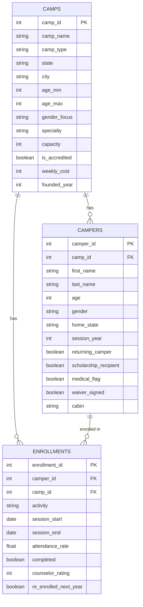

# 🏕️ CampQuery — AI-Powered Natural Language Camp Data Explorer

## What It Does
CampQuery lets non-technical users query summer camp data using plain English — no SQL required. Type a question, get an answer. Built to demonstrate how AI-powered natural language interfaces can make operational data accessible to camp directors, counselors, and operations staff.

## Live Demo
[Add Streamlit Cloud link here]

## Example Queries
- "Which campers haven't signed their waiver?"
- "Show me returning campers in New York"
- "Which activities have the highest attendance rates?"
- "Show campers at risk of not returning — low attendance, first year"

## How It Works
1. User types a plain English question
2. Claude AI translates it into a SQLite SELECT query
3. Query runs against the camp database
4. Results display as a clean table with the generated SQL visible

## Data Sources & Model
- **Camp schema** modeled after the ACA Find a Camp directory (acacamps.org) — the largest database of accredited U.S. summer camps
- **Camper and enrollment records** are fully synthetic (150 camps, 500 campers, 1,100 enrollments). Real camper-level data is not publicly available due to youth privacy protections — synthetic data is standard practice in camp management software development.
- Data distributions reflect real-world patterns: 65% returning campers, 18% scholarship recipients, 60% ACA-accredited camps

## Data Model



## Tech Stack
- Python + Streamlit
- Claude AI (Anthropic) — natural language to SQL
- SQLite
- Faker — synthetic data generation

## Run Locally
```bash
git clone https://github.com/nabilabbas250/campquery.git
cd campquery
python -m venv venv
source venv/bin/activate
pip install streamlit anthropic pandas faker
echo 'ANTHROPIC_API_KEY = "your-key-here"' > .streamlit/secrets.toml
python data_setup.py
streamlit run app.py
```

## Built By
Nabil Abbas · [LinkedIn](https://www.linkedin.com/in/nabil-abbas)
